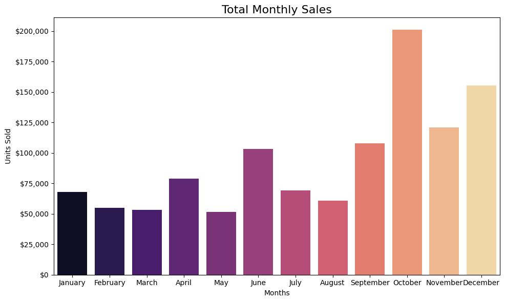

# Financial Analysts Project

This project is a Python-based financial data analysis notebook focused on understanding sales, profit, discount behavior, and business performance across countries, segments, and products. The analysis is implemented in `main.ipynb` and uses a sales dataset stored in `datasets/financials.csv`.

## Project Objective

The goal of this project is to explore how a company’s financial performance varies by:

- Country
- Product category
- Customer segment
- Sales period and month
- Discount band

The analysis turns raw transactional data into actionable business insights through cleaning, grouping, visualization, and comparison of key performance indicators.

## Dataset

The project uses the dataset located in:

- `datasets/financials.csv`
- `datasets/countries_minimum_maximum_profit.csv`

The dataset includes fields such as:

- `Country`
- `Segment`
- `Product`
- `Discount_Band`
- `Units_Sold`
- `Gross_Sales`
- `Sales`
- `COGS`
- `Profit`
- `Date`
- `Month_Name`
- `Year`

This data supports multi-dimensional analysis of sales performance and profitability over time.

## Project Structure

```text
financial_analysts/
├── main.ipynb                  # Main exploratory analysis notebook
├── README.md                   # Project overview and usage guide
├── datasets/
│   ├── financials.csv          # Main financial dataset
│   └── countries_minimum_maximum_profit.csv
├── images/
│   ├── flags/                  # Country flag images used in visualizations
│   ├── output.png
│   ├── gemini_1.png
│   └── ...
└── ...
```

## Analysis Workflow

The notebook walks through the following stages:

1. Importing and cleaning the dataset
2. Standardizing column names and resolving formatting issues
3. Calculating basic summary statistics
4. Aggregating sales and profit by country, segment, and product
5. Building comparative visualizations for 2013 and 2014
6. Mapping country-level performance using Plotly choropleth charts
7. Examining discount band distribution
8. Summarizing insights and key business findings

## Key Insights from the Analysis

The project highlights several important patterns in the data:

- Profitability differs significantly by country.
- France is the highest-profit country in the analysis, while Mexico is the lowest-profit country.
- Total profit across the analyzed locations is reported as approximately $16,893,702.29.
- Country-level profit and sales summaries are visualized with maps and bar charts for easier comparison.
- Product and segment performance are compared across years to reveal trends in business performance.
- Discount band patterns are evaluated to understand how pricing strategy influences transaction volume and profitability.
- Monthly and yearly trends help identify seasonal patterns in sales and profit.

## Technologies Used

The notebook uses:

- Python
- pandas
- NumPy
- Matplotlib
- Seaborn
- Plotly
- PIL / image processing for flag overlays

## Visualizations Included

The analysis includes a wide range of charts and dashboards, including:

- Profit by country
- Sales by country
- Sales and profit by segment
- Sales and profit by product
- Year-over-year comparisons
- Monthly sales and profit trends
- Geographic maps
- Discount band distribution charts
- Country flag-enhanced bar charts

## Example Visuals and Notebook Code

### 1) Monthly sales trend



This chart shows total monthly sales over time and helps reveal seasonal patterns or periods of stronger performance. The notebook groups sales by year and month, then plots a line chart for each year.

```python
# Grouping by Year and Month_Name, sum Sales
df_monthly_sales = df.groupby(['Year', 'Month_Name'])['Sales'].sum().reset_index()

# Ensuring that Month_Name is ordered correctly
df_monthly_sales['Month_Name'] = pd.Categorical(
    df_monthly_sales['Month_Name'],
    categories=month_order,
    ordered=True
)
df_monthly_sales = df_monthly_sales.sort_values(['Year', 'Month_Name'])

# Pivot for plotting
monthly_sales_pivot = df_monthly_sales.pivot(index='Month_Name', columns='Year', values='Sales')

fig = go.Figure()
for year in years:
    fig.add_trace(go.Scatter(
        x=monthly_sales_pivot.index,
        y=monthly_sales_pivot[year],
        mode='lines+markers',
        name=str(year)
    ))
```

### 2) Total units sold by product and year


This grouped bar chart compares annual unit sales by product, making it easier to spot which products are growing, declining, or performing consistently across years.

```python
# Grouping by Year and Product, sum Units_Sold
df_units_sold_year = df.groupby(['Year', 'Product'])['Units_Sold'].sum().reset_index()

# Pivot for plotting
df_units_sold_pivot = df_units_sold_year.pivot(
    index='Product',
    columns='Year',
    values='Units_Sold'
).fillna(0)

fig, ax = plt.subplots(figsize=(12, 6))
for i, year in enumerate(years):
    ax.bar(
        x + i * bar_width,
        df_units_sold_pivot[year],
        bar_width,
        label=str(year)
    )
```

### 3) Discount band distribution by year


This view shows how discount bands are distributed within each year. It helps analyze whether pricing promotions are concentrated in certain periods or product groups.

```python
# Preparing the data for each year
years_unique = df['Year'].unique()
fig, axes = plt.subplots(1, len(years_unique), figsize=(12, 6))

for idx, yr in enumerate(sorted(years_unique)):
    band_counts = df[df['Year'] == yr]['Discount_Band'].value_counts()
    axes[idx].pie(
        band_counts,
        labels=band_counts.index,
        autopct='%1.1f%%',
        startangle=90
    )
    axes[idx].set_title(f'Discount Band Distribution\nYear: {yr}')
```


## Notes

This project is intended for exploratory financial analysis and data storytelling. It is a useful example of how business data can be cleaned, transformed, and visualized to uncover trends and support strategic decision-making.

## Conclusion

This project demonstrates how Python and data visualization can be used to analyze financial performance across dimensions such as geography, product mix, segment, and time. It is a solid example of an end-to-end business analytics workflow built around a real sales dataset.
